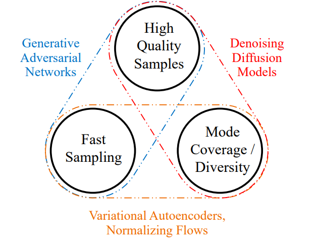
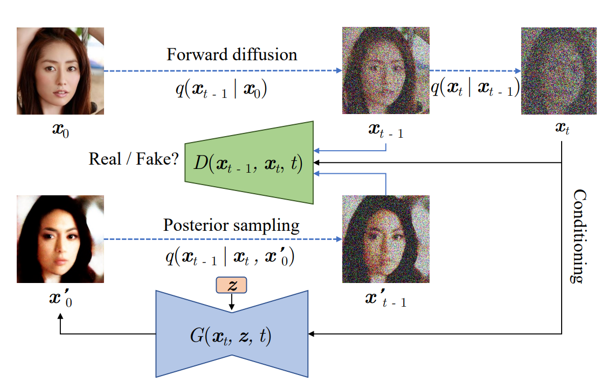

# `Sobre fairness na geração não condicional com modelos de difusão`
# `On the fairness of unconditional generation with Diffusion Models`

## Apresentação

O presente projeto foi originado no contexto das atividades da disciplina de pós-graduação *IA376L - Deep Learning aplicado a Síntese de Sinais*,
oferecida no primeiro semestre de 2022, na Unicamp, sob supervisão da Profa. Dra. Paula Dornhofer Paro Costa, do Departamento de Engenharia de Computação e Automação (DCA) da Faculdade de Engenharia Elétrica e de Computação (FEEC).

> |Nome  | RA | Especialização |
> |--|--|--|
> | Álvaro Airemoraes Capelo | 104534  | Eng. de Computação (DCA) |
> | Luiza Amador Pozzobon  | 233818  | Eng. de Computação (DCA) |
> | Tainá de Souza Coimbra  | 157305  | Eng. Elétrica/Computação (DECOM)|

## Descrição Resumida do Projeto

São frequentes os relatos de bias na geração de imagens sintéticas com Generative Adversarial Networks [1]. Um exemplo que repercutiu na mídia foi o caso em que o algoritmo PULSE [2], que faz o upsample de imagens em baixa resolucção, [transformou o presidente Barack Obama em um homem branco](https://twitter.com/Chicken3gg/status/1274314622447820801). Esse algoritmo utiliza uma StyleGAN [3] como base do espaço de busca para o upsampling.

Figura 1: Algoritmo PULSE [2] faz o upsampling do presidente Barack Obama para um homem branco.

Os resultados de um estudo posterior indicaram biases implícitos na StyleGAN [4] e bias racial nas imagens geradas: cerca de 73% das imagens geradas pelo método são de pessoas brancas, enquanto pessoas asiáticas e pretas aparecem em cerca de 14 e 10% das imagens sintéticas, respectivamente. Conforme os autores do estudo, a não geracão de faces sintéticas de grupos sub-representados diminui ainda mais a habilidade desses indivíduos de serem vistos e ouvidos [4]. Outro experimento com um conjunto de dados controlado [5] observou que, mesmo com uma população de treino constituída de classes balanceadas, StackedGANs [6] são incapazes de gerar imagens sintéticas com distribuições equivalentes. O problema é intensificado quando o conjunto de treino  ́e desbalanceado. Conclui-se, portanto, que o uso dessa família de modelos pode enviesar fortemente as tarefas posteriores para as quais os dados sintéticos serão utilizados, já que não respeitam o conceito de *statistical parity* onde “a demografia do conjunto de indivíduos recebendo qualquer classificação é equivalente à demografia da população como um todo” [7].

Recentemente outro modelo generativo obteve repercussão devido à qualidade das imagens sintéticas: o DALLE-2 [8]. O resultado foi atingido a partir do poder conjunto de modelos de difusão [9] e de *embeddings* do CLIP [10]. Neste trabalho, objetiva-se o estudo dos possíveis biases presentes em modelos de difusão, de forma similar ao que foi realizado por [5] para as StackedGANs. Mais especificamente, serão comparadas as distribuicões das imagens geradas versus as distribuicões do conjunto de treino controlado para Denoising Diffusion GANs (DDGANs) [11] e uma arquitetura de GAN que ainda será definida.

## Metodologia Proposta

Neste projeto investigaremos a capacidade de adequação à métrica de paridade estatística [7] de modelos generativos, com ênfase na comparação de modelos de difusão [9] com GANs [1]. Para isso, serão elaborados *toy problems* com o dataset MNIST para avaliação da distribuição das imagens sintéticas quando comparadas à distribuição do conjunto de treino. O modelo de difusão estudado será o Denoising Diffusion GAN (DDGAN) [11] e a arquitetura de GAN ainda será definida.

### Conjunto de dados

O conjunto de dados MNIST será reduzido de 10 para duas classes e em cada experimento a distribuição do conjunto de dados será controlada para avaliação da paridade estatística das imagens sintetizadas. Sendo assim, diferentemente do trabalho [5], a proporção das duas classes no conjunto de treino sofrerá modificações em cada experimento, ao invés das cores das imagens. Teremos três cenários de avaliação:

1. Classes 1 e 2 com 30 e 70% do conjunto de treino, respectivamente.
1. Classes 1 e 2 com 50 e 50% do conjunto de treino, respectivamente.
1. Classes 1 e 2 com 70 e 30% do conjunto de treino, respectivamente.

### Abordagens de modelagem generativa

#### DDGAN

*Denoising Diffusion GAN* é a rede proposta por [11] para combater o `trilemma` dos modelos generativos usuais (GANs, VAEs e modelos de difusão), cujos resultados são sempre um `trade-off` entre três fatores: (1) rápida amostragem, (2) alta qualidade e (3) cobertura das modas dos dados de treino. Conforme a Figura 2, modelos de difusão [9] geram amostras de ótima qualidade e com cobertura das modas do conjunto de treino, mas o tempo de amostragem é elevado, impedindo seu uso em aplicações do mundo real. Na arquitetura proposta, o processo de `denoising` é modelado por uma *Conditional GAN* [12], de forma a aumentar em até 2000x a velocidade de amostragem para o conjunto CIFAR10 mantendo a qualidade dos dados sintéticos do modelo de difusão original. A arquitetura da DDGAN pode ser observada na Figura 3.

#### Alguma arquitetura de GAN

### Ferramentas a serem utilizadas

- Bibliotecas padrão de data science (Python 3, PyTorch, Pandas, etc.)
- GitHub
- Google Colab
- Kaggle
- Overleaf

### Proposta de avaliação

### Resultados esperados

## Cronograma

| Tarefa                                               | 20/04 | 27/04 | 04/05 | 11/05 | 18/05 | 25/05 | 01/06 | 08/06 | 15/06 | 22/06 | 29/06 | 04/07 | 06/07 |
|------------------------------------------------------|-------|-------|-------|-------|-------|-------|-------|-------|-------|-------|-------|-------|-------|
| Readequação da proposta e levantamento bibliográfico | x     | x     | x     | x     | x     | x     |       |       |       |       |       |       |       |
| Experimentações iniciais com DDGAN                   |       |       |       | x     | x     | x     |       |       |       |       |       |       |       |
| Desenvolvimento dos cenários de experimentação       |       |       |       |       | x     | x     | x     |       |       |       |       |       |       |
| E2 - Checkpoint                                      |       |       |       |       |       | x     |       |       |       |       |       |       |       |
| Alterações e validação do código da DDGAN            |       |       |       |       |       | x     | x     | x     |       |       |       |       |       |
| Treinamento da DDGAN                                 |       |       |       |       |       |       | x     | x     | x     | x     | x     |       |       |
| Treinamento da GAN                                   |       |       |       |       |       |       | x     | x     | x     | x     | x     |       |       |
| E3 - Entrega do código                               |       |       |       |       |       |       |       |       |       |       |       | x     |       |
| Escrita de relatório e compilação de resultados      |       |       |       |       |       |       | x     | x     | x     | x     | x     | x     | x     |

## Referências Bibliográficas

[1] I. Goodfellow, J. Pouget-Abadie, M. Mirza, B. Xu, D. Warde-Farley, S. Ozair, A. Courville, and Y. Bengio, “Generative adversarial nets,” Advances in neural information processing systems, vol. 27, 2014.

[2] S. Menon, A. Damian, S. Hu, N. Ravi, and C. Rudin, “Pulse: Self-supervised photo upsampling via latent space exploration of generative models,” in Proceedings of the ieee/cvf conference on computer vision and pattern recognition, 2020, pp. 2437–2445.

[3] T. Karras, S. Laine, and T. Aila, “A style-based generator architecture for generative adversarial networks,” in Proceedings of the IEEE/CVF conference on computer vision and pattern recognition, 2019, pp. 4401–4410.

[4] J. Salminen, S.-g. Jung, S. Chowdhury, and B. J. Jansen, “Analyzing demographic bias in artificially generated facial pictures,” in Extended Abstracts of the 2020 CHI Conference on Human Factors in Computing Systems, 2020, pp. 1–8.

[5] P. J. Kenfack, D. D. Arapov, R. Hussain, S. A. Kazmi, and A. Khan, “On the fairness of generative adversarial networks (gans),” in 2021 International Conference” Nonlinearity, Information and Robotics”(NIR). IEEE, 2021, pp. 1–7.

[6] X. Huang, Y. Li, O. Poursaeed, J. Hopcroft, and S. Belongie, “Stacked generative adversarial networks,” in Proceedings of the IEEE conference on computer vision and pattern recognition, 2017, pp. 5077–5086.

[7] C. Dwork, M. Hardt, T. Pitassi, O. Reingold, and R. Zemel, “Fairness through awareness,” in Proceedings of the 3rd innovations in theoretical computer science conference, 2012, pp. 214–226.

[8] A. Ramesh, P. Dhariwal, A. Nichol, C. Chu, and M. Chen, “Hierarchical text-conditional image generation with clip latents,” arXiv preprint arXiv:2204.06125, 2022.

[9] J. Ho, A. Jain, and P. Abbeel, “Denoising diffusion probabilistic models,” Advances in Neural Information Processing Systems, vol. 33, pp. 6840–6851, 2020.

[10] A. Radford, J. W. Kim, C. Hallacy, A. Ramesh, G. Goh, S. Agarwal, G. Sastry, A. Askell, P. Mishkin, J. Clark et al., “Learning transferable visual models from natural language supervision,” in International Conference on Machine Learning. PMLR, 2021, pp. 8748–8763.

[11] Z. Xiao, K. Kreis, and A. Vahdat, “Tackling the generative learning trilemma with denoising diffusion gans,” arXiv preprint arXiv:2112.07804, 2021.

[12] M. Mirza and S. Osindero, “Conditional generative adversarial nets,” arXiv preprint arXiv:1411.1784, 2014.
