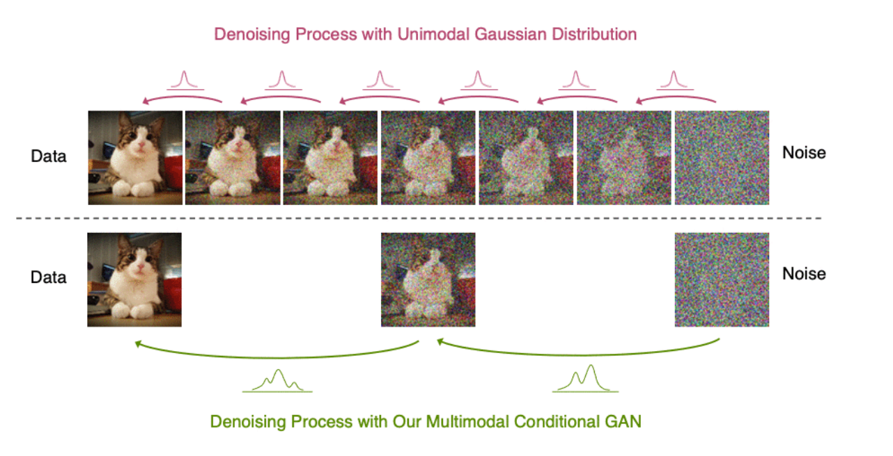

# `Sobre fairness na geração não condicional com modelos de difusão`
# `On the fairness of unconditional generation with Diffusion Models`

## Apresentação

O presente projeto foi originado no contexto das atividades da disciplina de pós-graduação *IA376L - Deep Learning aplicado a Síntese de Sinais*,
oferecida no primeiro semestre de 2022, na Unicamp, sob supervisão da Profa. Dra. Paula Dornhofer Paro Costa, do Departamento de Engenharia de Computação e Automação (DCA) da Faculdade de Engenharia Elétrica e de Computação (FEEC).

> |Nome  | RA | Especialização |
> |--|--|--|
> | Álvaro Airemoraes Capelo | 104534  | Eng. de Computação (DCA) |
> | Luiza Amador Pozzobon  | 233818  | Eng. de Computação (DCA) |
> | Tainá de Souza Coimbra  | 157305  | Eng. Elétrica/Computação (DECOM)|

## Resumo

A análise da capacidade de generalização e da representatividade em modelos generativos, em particular sobre a ótica de vieses, tem ganhado interesse da comunidade científica desde o recente renovado interesse na área de síntese de imagens proporcionado pelo desenvolvimento das Redes Generativas Adversárias. Entretanto, tem-se observado que essa família de arquiteturas produz viéses de amostragem, o que tem despertado intenso interesse da comunidade científica. Recentemente, um modelo de síntese estado-da-arte baseado em processos de difusão foi proposto [1], e os resultados reportados apontam para a solução do problema de representatividade (medido pela presença de todas as modas) do conjunto de dados de treino das GANs.

Neste trabalho, será avaliado se a cobertura de modas atingida significa também paridade demográfica [2]. Serão treinados um modelo dessa arquitetura estado-da-arte, a _Denoising Diffusion GAN_, e um modelo da família das GANs, a ser definido, em um conjunto de dados MNIST modificado [3]. Dois grupos serão criados no conjunto de dados: i) número branco e fundo branco, e ii) número preto e fundo branco. Serão realizados experimentos para três conjuntos de dados com diferentes proporções de imagens dos grupos (i) e (ii) no treino dos modelos: 30:70, 50:50 e 70:30. A seguir, serão sintetizadas *n* amostras de forma não condicionada, cujas proporções de imagens dos grupos (i) e (ii) serão comparadas com a do conjunto de dados de treino.

## Descrição do Problema e Motivação

São frequentes os relatos de viéses na geração de imagens sintéticas com *Generative Adversarial Networks* [4]. Um exemplo que repercutiu na mídia foi o caso em que o algoritmo PULSE [5], que faz o upsample de imagens em baixa resolucção, [transformou o presidente Barack Obama em um homem branco](https://twitter.com/Chicken3gg/status/1274314622447820801). Esse algoritmo utiliza uma StyleGAN [6] como base do espaço de busca para o upsampling.

Figura 1: Algoritmo PULSE [5] faz o upsampling do presidente Barack Obama para um homem branco.

Os resultados de um estudo posterior indicaram biases implícitos na *StyleGAN* [2] e viés racial nas imagens geradas: cerca de 73% das imagens geradas pelo método são de pessoas brancas, enquanto pessoas asiáticas e pretas aparecem em cerca de 14 e 10% das imagens sintéticas, respectivamente. Conforme os autores do estudo, a não geração de faces sintéticas de grupos sub-representados diminui ainda mais a habilidade desses indivíduos de serem vistos e ouvidos [2]. Entretanto, neste estudo não está claro se o problema de viés é exclusivo da arquitetura ou se tem interferência da distribuição dos dados de treinamento. Outro experimento com um conjunto de dados controlado [3] observou que, mesmo com uma população de treino constituída de classes balanceadas, StackedGANs [7] são incapazes de gerar imagens sintéticas com distribuições equivalentes. O problema é intensificado quando o conjunto de treino é desbalanceado. Conclui-se, portanto, que o uso dessa família de modelos pode enviesar as tarefas posteriores para as quais os dados sintéticos serão utilizados, já que não respeitam o conceito de *paridade demográfica* [2].

Recentemente outros dois modelo generativos obtiveram repercussão devido à qualidade das imagens sintéticas: o Imagen [8] e o DALLE-2 [9]. Os resultado foram atingidos a partir do poder conjunto de modelos de difusão [9] e de *embeddings* do T5 [11] ou do CLIP [12], respectivamente. Neste trabalho, objetiva-se o estudo dos possíveis viéses presentes em modelos de difusão, de forma similar ao que foi realizado por [3] para as *StackedGANs*. Mais especificamente, serão comparadas as distribuicões das imagens geradas versus as distribuições do conjunto de treino controlado para *Denoising Diffusion GANs (DDGANs)* [1] e uma arquitetura de GAN que ainda será definida.

## Objetivos

Avaliar se a solução proposta pela arquitetura _Desnoising Diffusion GANs_ (DDGANs) para o problema de cobertura de moda das arquiteturas baseadas em GANs também significa que paridade demográfica é atingida na distribuição das imagens geradas.

### Objetivos específicos

Avaliar se a densidade de probabilidade para os diferentes grupos de imagens do conjunto de dados de treino é reproduzida pelos modelos DDGAN e a rede GAN a ser definida.

## Metodologia Proposta

Neste projeto investigaremos a capacidade de adequação à métrica de paridade demográfica [2] de modelos generativos, com ênfase na comparação de modelos de difusão [10] com GANs [4]. Para isso, serão elaborados *toy problems* com o dataset MNIST para avaliação da distribuição das imagens sintéticas quando comparadas à distribuição do conjunto de treino. O modelo de difusão estudado será o _Denoising Diffusion GAN_ (DDGAN) [1] e a arquitetura de GAN ainda será definida.

### Conjunto de dados

O conjunto de dados MNIST sera modificado para que todas as classes (dígitos) correspondam a um dos dois grupos:
- Grupo 1: imagens tradicionais do MNIST, dígitos em branco, fundo preto
- Grupo 2: imagens MNIST invertidas, com dígitos em preto e fundo branco

A seguir, três cenários de experimentação serão avaliados variando as proporções de cada grupo:
- Cenario A: Grupo 1 e 2 com 30 e 70% do conjunto de treino, respectivamente.
- Cenario B: Grupos 1 e 2 com 50 e 50% do conjunto de treino, respectivamente.
- Cenario C: Grupos 1 e 2 com 70 e 30% do conjunto de treino, respectivamente.

### Abordagens de modelagem generativa

#### DDGAN

*Denoising Diffusion GAN* é a rede proposta por [1] para combater o _trilemma_ dos modelos generativos usuais (GANs, VAEs e modelos de difusão), cujos resultados são sempre um _trade-off_ entre três fatores: (1) rápida amostragem, (2) alta qualidade e (3) cobertura das modas dos dados de treino. Conforme a Figura 2, modelos de difusão [10] geram amostras de ótima qualidade e com cobertura das modas do conjunto de treino, mas o tempo de amostragem é elevado, impedindo seu uso em aplicações do mundo real. Na arquitetura proposta, o processo de _denoising_ é modelado por uma *Conditional GAN* [13], em vez de por Gaussianas Multimodais como nos modelos de difusão clássicos. Essa mudança na arquitetura, ilustrada na Figura 3, permite aumentar em até 2000 vezes a velocidade de amostragem para o conjunto CIFAR10 mantendo a qualidade dos dados sintéticos do modelo de difusão original. A arquitetura da DDGAN pode ser observada na Figura 4.

Figura 2. O _trilemma_ de modelos genrativos

Figura 3. Mudança introduzida pelas DDGANs: modelagem de _denoising_ usando GANs multimodais

Figura 4. Arquitetura da DDGAN [1]

### Ferramentas a serem utilizadas

- Bibliotecas padrão de data science (Python 3, PyTorch, Pandas, etc.)
- GitHub
- Google Colab
- Kaggle
- Overleaf

### Proposta de avaliação

Propomos utilizar abordagem semelhante ao que foi feito em [3], isto é, medir a densidade de probabilidade dos grupos nas imagens sintetizadas de forma não condicionada e comparar com as densidades nos conjuntos de dados de treino. Com esta metodologia, propõe-se avaliar a representatividade e o viés em imagens sintéticas aproximando o conceito de paridade demográfica usado por Salminen et al. [2], em que um algoritmo sem viés deveria produzir imagens para cada grupo com a mesma probabilidade [2].

### Resultados esperados

#### Adequações do código

Até o momento, foi feita a readequação da proposta do projeto, visto que houve uma mudança temática. Foi decidido trabalhar com o artigo [1], mais especificamente o problema de viés, questão não muito explorada pelo autor, que focou apenas na demonstração de que a DDGAN cobre todas as modas. Isto é diferente da proposta do nosso trabalho, que pretende avaliar como diferentes proporções de grupos no conjunto de dados de treino afetam a paridade demográfica desses grupos no resultado. A fim de explorar melhor este assunto, prosseguimos com estudos de artigos relativos a modelos de difusão, problemas de viés e como medi-los, cobertura de moda, etc.

Em termos práticos, foi feita a configuração do código da DDGAN apresentado em [1] para rodar a base MNIST e o MNIST controlado (adaptado com diferentes proporções). O código da DDGAN é extenso e a estrutura utilizada para treino é complexa, dificultando ligeiramente a manipulação e tornando o treino computacionalmente custoso. Entretanto, são fornecidos diversos parâmetros de entrada que permitem modificar relativamente a estrutura principal. Espera-se que assim seja possível o uso no Google Colab para treinamento dos modelos.

### Conclusão

Será analisada a paridade demográfica [2] das modas em modelos de difusão, em especial a DDGAN que utiliza uma GAN condicional durante o processo de _denoising_. Pelo trilema das redes generativas [1], modelos de difusão são eficientes para gerar amostras de alta qualidade e diversidade (baixo viés), porém com um alto tempo de amostragem. A ideia do uso da CGAN para a etapa de denoising é para justamente diminuir esse tempo de amostragem. Queremos verificar o quanto o uso da GAN na DDGAN afeta o viés, em termos da paridade demográfica, ao mesmo tempo em que permite o baixo tempo de amostragem, visto que a GAN é conhecida por produzir amostras com pouca diversidade. Para identificar essa influência do viés nos modelos, vamos utilizar como base as métricas descritas em [3]. Já começamos a modificar o código da DDGAN para a nossa base MNIST modificada, mas ainda faltam etapas para a finalização do projeto, especialmente o treinamento dos modelos. Para isso, precisamos: (i) Terminar de ajustar o código e treinar a DDGAN para a base MNIST modificada (ii) Rodar resultados da DDGAN para datasets de diferentes proporções do MNIST controlado, (iii) Implementação de uma GAN para comparações de resultados com a DDGAN, (iv) Análise dos resultados com base em métricas de viés, (v) Escrita de relatório. Estas etapas estão sumarizadas no cronograma abaixo.

## Cronograma

| Tarefa                                               | 20/04 | 27/04 | 04/05 | 11/05 | 18/05 | 25/05 | 01/06 | 08/06 | 15/06 | 22/06 | 29/06 | 04/07 | 06/07 |
|------------------------------------------------------|-------|-------|-------|-------|-------|-------|-------|-------|-------|-------|-------|-------|-------|
| Readequação da proposta e levantamento bibliográfico | x     | x     | x     | x     | x     | x     |       |       |       |       |       |       |       |
| Experimentações iniciais com DDGAN                   |       |       |       | x     | x     | x     |       |       |       |       |       |       |       |
| Desenvolvimento dos cenários de experimentação       |       |       |       |       | x     | x     | x     |       |       |       |       |       |       |
| E2 - Checkpoint                                      |       |       |       |       |       | x     |       |       |       |       |       |       |       |
| Alterações e validação do código da DDGAN            |       |       |       |       |       | x     | x     | x     |       |       |       |       |       |
| Treinamento da DDGAN                                 |       |       |       |       |       |       | x     | x     | x     | x     | x     |       |       |
| Treinamento da GAN                                   |       |       |       |       |       |       | x     | x     | x     | x     | x     |       |       |
| E3 - Entrega do código                               |       |       |       |       |       |       |       |       |       |       |       | x     |       |
| Escrita de relatório e compilação de resultados      |       |       |       |       |       |       | x     | x     | x     | x     | x     | x     | x     |

## Referências Bibliográficas

[1] Z. Xiao, K. Kreis, and A. Vahdat, “Tackling the generative learning trilemma with denoising diffusion gans,”arXiv preprint arXiv:2112.07804, 2021.

[2] J. Salminen, S.-g. Jung, S. Chowdhury, and B. J. Jansen, “Analyzing demographic bias in artificially generated facial pictures,” in Extended Abstracts of the 2020 CHI Conference on Human Factors in Computing Systems, 2020, pp. 1–8.

[3] P. J. Kenfack, D. D. Arapov, R. Hussain, S. A. Kazmi, and A. Khan, “On the fairness of generative adversarial networks (gans),” in 2021 International Conference” Nonlinearity, Information and Robotics”(NIR). IEEE, 2021, pp. 1–7.

[4] I. Goodfellow, J. Pouget-Abadie, M. Mirza, B. Xu, D. Warde-Farley, S. Ozair, A. Courville, and Y. Bengio, “Generative adversarial nets,” Advances in neural information processing systems, vol. 27, 2014.

[5] S. Menon, A. Damian, S. Hu, N. Ravi, and C. Rudin, “Pulse: Self-supervised photo upsampling via latent space exploration of generative models,” in Proceedings of the ieee/cvf conference on computer vision and pattern recognition, 2020, pp. 2437–2445.

[6] T. Karras, S. Laine, and T. Aila, “A style-based generator architecture for generative adversarial networks,” in Proceedings of the IEEE/CVF conference on computer vision and pattern recognition, 2019, pp. 4401–4410.

[7] X. Huang, Y. Li, O. Poursaeed, J. Hopcroft, and S. Belongie, “Stacked generative adversarial networks,” in Proceedings of the IEEE conference on computer vision and pattern recognition, 2017, pp. 5077–5086.

[8] C. Saharia, W. Chan, S. Saxena, L. Li, J. Whang, E. Denton, S. K. S. Ghasemipour, B. K. Ayan, S. S. Mahdavi, R. G. Lopes, T. Salimans, J. Ho, D. J. Fleet, and M. Norouzi, “Photorealistic text-to-image diffusion models with deep language understanding,” 2022. [Online]. Available: https://arxiv.org/abs/2205.11487

[9] A. Ramesh, P. Dhariwal, A. Nichol, C. Chu, and M. Chen, “Hierarchical text-conditional image generation with clip latents,” arXiv preprint arXiv:2204.06125, 2022.

[10] J. Ho, A. Jain, and P. Abbeel, “Denoising diffusion probabilistic models,” Advances in Neural Information Processing Systems, vol. 33, pp. 6840–6851, 2020.

[11] C. Raffel, N. Shazeer, A. Roberts, K. Lee, S. Narang, M. Matena, Y. Zhou, W. Li, and P. J. Liu, “Exploring the limits of transfer learning with a unified text-to-text transformer,” arXiv preprint arXiv:1910.10683, 2019.

[12] A. Radford, J. W. Kim, C. Hallacy, A. Ramesh, G. Goh, S. Agarwal, G. Sastry, A. Askell, P. Mishkin, J. Clark et al., “Learning transferable visual models from natural language supervision,” in International Conference on Machine Learning. PMLR, 2021, pp. 8748–8763.

[13] M. Mirza and S. Osindero, “Conditional generative adversarial nets,” arXiv preprint arXiv:1411.1784, 2014.
