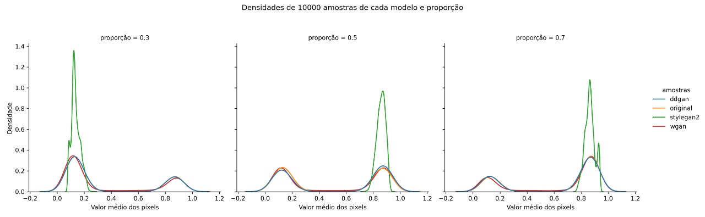
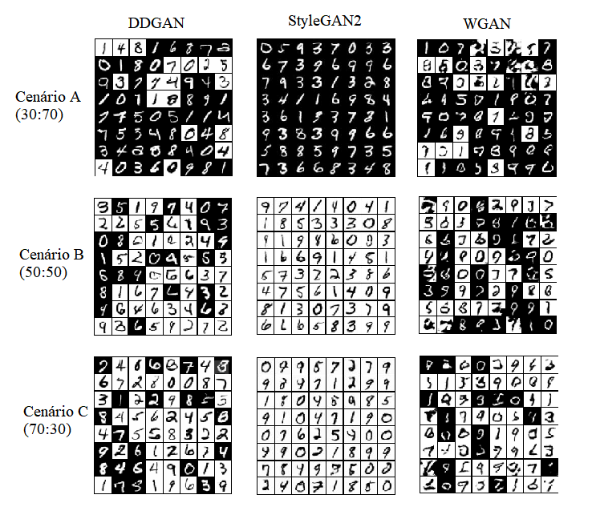

# `Sobre fairness na geração não condicional com modelos de difusão`
# `On the fairness of unconditional generation with Diffusion Models`

## Apresentação

O presente projeto foi originado no contexto das atividades da disciplina de pós-graduação *IA376L - Deep Learning aplicado a Síntese de Sinais*,
oferecida no primeiro semestre de 2022, na Unicamp, sob supervisão da Profa. Dra. Paula Dornhofer Paro Costa, do Departamento de Engenharia de Computação e Automação (DCA) da Faculdade de Engenharia Elétrica e de Computação (FEEC).

> |Nome  | RA | Especialização |
> |--|--|--|
> | Álvaro Airemoraes Capelo | 104534  | Eng. Químico |
> | Luiza Amador Pozzobon  | 233818  | Eng. de Controle e Automação |
> | Tainá de Souza Coimbra  | 157305  | Eng. Eletricista |

## Execução do projeto

O tutorial de como executar o projeto está disponível no [README_SETUP.md](README_SETUP.md)

## Links

O relatório com a metodologia e com os resultados do projeto podem ser visualizados [neste link](images/report/IA376L___Diffusion_Models.pdf).

Os pesos dos modelos e parâmetros de treinamentos então [neste link](https://drive.google.com/drive/folders/1_1NgQeAKMasldrXMclZT_M4AzfjP8Jbl?usp=sharing).

As curvas de treinamento estão nos links a seguir:
- DDGAN, [todos os cenários](https://wandb.ai/lupozz/ddgan-mnist).
- StyleGAN2: [Cenário A](https://wandb.ai/lupozz/stylegan2-stylegan2_0.3), [Cenário B](https://wandb.ai/lupozz/stylegan2-stylegan2_0.5), [Cenário C](https://wandb.ai/lupozz/stylegan2-stylegan2_0.7)
- WGAN: [Cenário A](https://wandb.ai/coimbra574/WGAN-mnist/runs/3s5jrir5?), [Cenário B](https://wandb.ai/coimbra574/WGAN-mnist/runs/mir0hmmo?), [Cenário C](https://wandb.ai/alvaroacapelo/WGAN-mnist/runs/18kh3utg)

### Estrutura de teste

- Grupo 1: imagens MNIST invertidas, com dígitos em preto e fundo branco
- Grupo 2: imagens tradicionais do MNIST, dígitos em branco, fundo preto

Três cenários de experimentação foram avaliados variando as proporções de cada grupo:

1. Cenário A: Grupo 1 e 2 com 30 e 70\% do conjunto de treino, respectivamente.
2. Cenário B: Grupos 1 e 2 com 50 e 50\% do conjunto de treino, respectivamente.
3. Cenário C: Grupos 1 e 2 com 70 e 30\% do conjunto de treino, respectivamente.

### Resultados

Figura 1: Comparação das densidades de imagens sintetizadas por cada arquitetura (DDGAN, StyleGAN2 e WGAN) versus a densidade original dos dados em três cenários de teste. Os cenários de teste correspondem ao treinamento dos modelos sob diferentes proporções do dataset MNIST com fundo preto ou branco.

Figura 2: Amostras geradas por cada arquitetura em cada cenário de teste.
